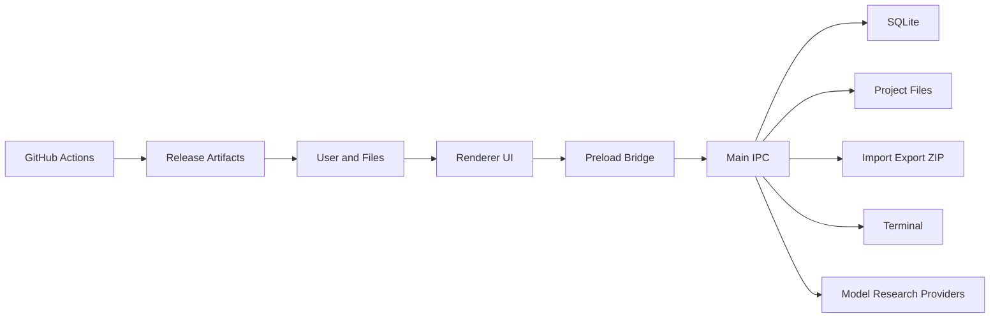

# InkForge 威胁模型

## Executive summary

InkForge 是本地优先 Electron 写作应用，最高风险集中在高权限主进程能力被 renderer 输入触达、导入文件/ZIP/Markdown 等不可信内容解析、模型服务密钥保护、内嵌终端能力、以及未签名 Windows beta 发布链路。现有架构已经启用 `contextIsolation`、禁用 `nodeIntegration`，并在 IPC 层持续增加运行时校验；后续安全工作应优先收敛文件路径类 IPC、项目包导入、终端 spawn、市场安装和外部 URL 打开。

## Scope and assumptions

In scope:

- Runtime desktop app: `apps/desktop/src/main`, `apps/desktop/src/preload`, `apps/desktop/src/renderer`.
- Shared IPC contract: `packages/shared/src/ipc/*`, `packages/shared/src/preload.ts`.
- Local persistence and secrets: `packages/storage/src/*`.
- Build/release controls: `.github/workflows/ci.yml`, `.github/workflows/release.yml`, `apps/desktop/package.json`.

Out of scope:

- A local OS admin or local malware that can read the user profile and project files directly.
- Model provider infrastructure compromise.
- Human content quality, copyright review, and prompt policy enforcement.

Assumptions:

- InkForge has no hosted backend and no cloud sync by default.
- Ordinary attacker can supply files, Markdown/EPUB/TXT/project packages, skill packs, marketplace registry data, model output, and URLs that the user chooses to open.
- External model and research providers are untrusted network boundaries.
- User project files may contain private unpublished writing.
- Windows beta artifacts are currently unsigned.

Open questions that could change risk:

- Whether future auto-update will become enabled by default and where update metadata is hosted.
- Whether project packages will be accepted from a public sharing ecosystem.
- Whether Skill packs will gain executable code capabilities; current model is prompt/config data.

## System model

### Primary components

- Renderer UI: React app loaded inside Electron renderer, exposed to `window.inkforge` through preload.
- Preload bridge: typed namespace that forwards renderer calls to `ipcRenderer.invoke`.
- Main process IPC handlers: trusted side that reads/writes files, SQLite, terminal, external URLs, model calls and package import/export.
- Local storage: SQLite metadata plus Markdown/files in project directories.
- External integrations: model providers, research providers, skill marketplace/registry URLs, release/update metadata.
- CI/release: GitHub Actions typecheck/test/build/e2e, Windows packaged UI smoke, electron-builder packaging.

Evidence anchors:

- Renderer isolation: `apps/desktop/src/main/window.ts` has `contextIsolation: true`, `nodeIntegration: false`, `sandbox: true`.
- IPC registration: `apps/desktop/src/main/ipc/register.ts`.
- IPC validators: `apps/desktop/src/main/ipc/validation/*`.
- File and terminal surfaces: `apps/desktop/src/main/ipc/fs.ts`, `apps/desktop/src/main/ipc/terminal.ts`.
- Project package import/export: `apps/desktop/src/main/ipc/project-package.ts`, `apps/desktop/src/main/services/project-package-service.ts`.
- Secrets storage: `packages/storage/src/keystore.ts`, provider key repositories.
- Release posture: `apps/desktop/package.json` has `signAndEditExecutable: false`; workflows set `CSC_IDENTITY_AUTO_DISCOVERY=false`.

### Data flows and trust boundaries

- User -> Renderer: writing text, prompts, imported files, package selections, UI actions; browser/Electron event channel; no auth boundary; all input untrusted.
- Renderer -> Preload -> Main: typed IPC payloads; Electron IPC; runtime validators exist for many channels, including project package validation; still a privileged boundary.
- Main -> SQLite/project files: metadata rows, Markdown, covers, snapshots, package archives; local file I/O; integrity depends on path validation and project ownership checks.
- Main -> Model/research providers: prompts, excerpts, metadata, API keys used in process memory; HTTPS via provider SDKs/adapters; provider responses untrusted.
- Main -> External URL/system shell: URL open and terminal spawn; OS boundary; strict allowlists and user intent required.
- CI/release -> User install: GitHub artifact build and release; unsigned beta binaries; user must verify source/hash manually.

#### Diagram

## Assets and security objectives

| Asset | Why It Matters | Security Objective |
| --- | --- | --- |
| Provider API keys | Paid model access, account abuse risk | C/I |
| Unpublished writing/project files | Private intellectual property | C/I/A |
| SQLite metadata | Project structure, characters, worldbuilding, history | I/A |
| Project package imports | Can write many files/rows at once | I/A |
| Main process capabilities | File system, terminal, external URL, network calls | I/A |
| Release artifacts | User trust and supply chain integrity | I |
| Review/AutoWriter outputs | Can influence user manuscript decisions | I |

## Attacker model

### Capabilities

- Convince a user to import a malicious `.inkforge.zip`, EPUB, TXT, Markdown, Skill pack, or registry entry.
- Return malicious model output or research content that renderer later displays.
- Provide URLs that could be opened externally.
- Attempt to abuse IPC payloads if renderer script execution is achieved.
- Tamper with unsigned binaries outside the official GitHub release channel.

### Non-Capabilities

- Cannot bypass OS user isolation without a local compromise.
- Cannot read API keys directly from renderer Web Storage in the current design if keys remain in storage/keychain.
- Cannot call main-process APIs without renderer/preload IPC access.

## Entry points and attack surfaces

| Surface | How Reached | Trust Boundary | Notes | Evidence |
| --- | --- | --- | --- | --- |
| IPC handlers | `window.inkforge.*` | Renderer to main | Main process performs privileged work | `apps/desktop/src/main/ipc/register.ts` |
| File pick/save | UI file dialogs | User file to main | Reads/writes selected paths | `apps/desktop/src/main/ipc/fs.ts` |
| Project package import | `.inkforge.zip` | Archive to DB/files | Path traversal and archive bomb risk | `apps/desktop/src/main/services/project-package-service.ts` |
| TXT/EPUB import | import dialog | Untrusted document parser | Parser robustness and large file risk | `apps/desktop/src/main/ipc/project-export.ts` |
| Skill market/install | registry URL/pack | Network/package data to local DB | Prompt/config poisoning risk | `apps/desktop/src/main/ipc/market.ts` |
| External model calls | provider config | Local secrets to network | Prompt data and API key use | `apps/desktop/src/main/services/llm-runtime.ts` |
| Terminal | terminal UI | Renderer intent to OS process | Command execution capability | `apps/desktop/src/main/ipc/terminal.ts` |
| External URLs | link/open action | App to OS browser | Phishing and unsafe protocol risk | `apps/desktop/src/main/external-url.ts` |
| Release artifact | GitHub release download | Build system to user machine | Unsigned beta warning | `apps/desktop/package.json`, `.github/workflows/release.yml` |

## Top abuse paths

1. Malicious project package -> ZIP path traversal -> write outside intended project directory -> overwrite user files or implant startup/config files.
2. Malicious project package -> archive bomb -> excessive memory/disk use -> app freeze or storage exhaustion.
3. Renderer XSS from untrusted Markdown/model output -> attacker invokes high-risk IPC -> reads/writes selected files, imports packages, or spawns terminal.
4. Malicious Skill registry entry -> user installs prompt/config pack -> model prompts are silently steered -> story data exfiltrated through model calls or corrupted outputs.
5. Prompt injection in imported research/model output -> AutoWriter/Review trusts malicious instructions -> manuscript integrity degraded.
6. Phishing URL in generated/imported content -> external open -> user lands on credential capture page.
7. Unsigned Windows artifact tampered outside GitHub -> user bypasses SmartScreen -> attacker gets local code execution.
8. Terminal IPC exposed after renderer compromise -> arbitrary shell command execution as current user.

## Threat model table

| Threat ID | Threat Source | Prerequisites | Threat Action | Impact | Impacted Assets | Existing Controls | Gaps | Recommended Mitigations | Detection Ideas | Likelihood | Impact Severity | Priority |
| --- | --- | --- | --- | --- | --- | --- | --- | --- | --- | --- | --- | --- |
| TM-001 | Malicious import package | User imports attacker package | Path traversal or unsafe file paths write outside project | Overwrite user files, corrupt workspace | Project files, filesystem integrity | Project package service rejects absolute paths, backslashes, `..`, entry count/size caps | Needs fuzz/negative tests beyond current script | Add corpus tests for malformed ZIP, duplicate entries, zip64, huge names; log rejected package reason | Count import failures by reason in diagnostics | Medium | High | High |
| TM-002 | Renderer compromise | XSS or unsafe rendering of model/imported content | Invoke privileged IPC | File write/read, terminal spawn, package import | Main process, project files, secrets-adjacent state | `contextIsolation: true`, `nodeIntegration: false`, `sandbox: true`; validators under `ipc/validation` | Some IPC channels still rely on ad hoc validation and user dialog safety | Continue zod/valibot-style schemas for all file/path/process IPC; add central authorization for dangerous channels | IPC audit log for terminal spawn, package import/export, external URL open | Medium | High | High |
| TM-003 | Malicious terminal input | Renderer compromised or user tricked | Spawn shell/process | Arbitrary code as current user | User account, project files | Terminal IPC has validation entry points | In-app terminal is inherently high risk for a writing app | Add explicit first-use warning, restrict cwd, consider feature flag/dev mode, audit spawn args | Log terminal spawn command/cwd without secrets | Low | High | Medium |
| TM-004 | Compromised provider/registry/network content | User fetches registry or model output | Prompt/config poisoning or malicious Markdown | Manuscript corruption, data leakage via prompts | Writing content, model prompts | External URL helper limits to HTTP/HTTPS; Skill validation exists | Content trust and provenance UI limited | Show source/provenance for installed Skill packs; pin/verify registry manifests; sanitize Markdown rendering | Track installed pack source/hash/version | Medium | Medium | Medium |
| TM-005 | Secret theft through storage weakness | Local file read without OS compromise is not assumed, but backup/package/export mistakes are plausible | Export encrypted keys or store keys in renderer-accessible state | Paid API abuse | Provider API keys | Keychain + AES-GCM fallback; package explicitly excludes provider/provider_keys/app_settings | Need regression tests ensuring package excludes secret tables | Add verifier asserting package JSON does not contain `api_key`, `provider_keys`, `keystore` | CI grep on generated sample package metadata | Low | High | Medium |
| TM-006 | Unsigned artifact tampering | User downloads outside trusted GitHub release path | Replace installer/exe | Local code execution | User machine, all local files | CI builds and packaged UI smoke; README notes unsigned beta; automatic installation disabled; release tag/version guard; all platforms required | No Authenticode signing, SmartScreen reputation absent | Keep SHA256 in release notes; sign when budget allows; publish provenance/SLSA attestation | Release hash verification job and public checksum manifest | Medium | High | High |
| TM-007 | Archive/data DoS | User imports huge file/package | Memory/disk exhaustion | App freeze, failed writes | Availability | Package reader has entry and byte caps | TXT/EPUB import may need comparable caps | Apply size caps to all import parsers; stream large reads where feasible | Import duration and size diagnostics | Medium | Medium | Medium |
| TM-008 | Prompt injection in research/model content | Malicious web/model content enters context | Instruct model to ignore project facts or leak context | Lower manuscript integrity, possible prompt data disclosure | Project context, writing quality | Review/AutoWriter use structured context and can show findings | No universal prompt-injection filter | Treat external notes as quoted data; label source trust; add tests with hostile instructions | Store source tags and warning flags on imported research | Medium | Medium | Medium |

## Criticality calibration

- Critical: reliable pre-auth or renderer-triggered RCE in default app, automatic secret exfiltration, silent signed-update compromise. Example: terminal spawn reachable from XSS without user intent.
- High: file overwrite outside workspace, unsigned artifact tampering, package import that corrupts a project. Example: ZIP traversal writing into user startup folder.
- Medium: targeted DoS, prompt/config poisoning, provenance gaps. Example: malicious Skill pack changes review prompts and degrades output.
- Low: diagnostics-only leaks, UI-only spoofing without privileged action, issues requiring local admin.

## Focus paths for security review

| Path | Why It Matters | Related Threat IDs |
| --- | --- | --- |
| `apps/desktop/src/main/services/project-package-service.ts` | Bulk archive import/export and path validation | TM-001, TM-005, TM-007 |
| `apps/desktop/src/main/ipc/validation/*` | Runtime IPC schema boundary | TM-002 |
| `apps/desktop/src/main/ipc/fs.ts` | File picker/save bridge | TM-002, TM-007 |
| `apps/desktop/src/main/ipc/terminal.ts` | OS process capability | TM-002, TM-003 |
| `apps/desktop/src/main/services/terminal-service.ts` | Actual terminal spawn implementation | TM-003 |
| `apps/desktop/src/main/ipc/market.ts` | Skill registry/install entry | TM-004 |
| `packages/skill-engine/src/pack.ts` | Skill pack import/export validation | TM-004 |
| `apps/desktop/src/main/services/llm-runtime.ts` | Model provider calls and secret use | TM-005, TM-008 |
| `packages/storage/src/keystore.ts` | Secret encryption/keychain fallback | TM-005 |
| `.github/workflows/release.yml` | Artifact publishing and signing posture | TM-006 |
| `apps/desktop/package.json` | electron-builder signing/package config | TM-006 |
| `apps/desktop/src/renderer/src/components/ExportDialog.tsx` | User entry to export/import workflows | TM-001 |

## Quality check

- Covered discovered runtime entry points: IPC, file import/export, package import, market, model calls, terminal, external URLs.
- Covered each trust boundary at least once in threats.
- Separated runtime app risks from CI/release artifact risks.
- Stated assumptions and open questions explicitly.
- Avoided claiming that code signing, clean-machine installer testing, or real-user security usability has been completed.
